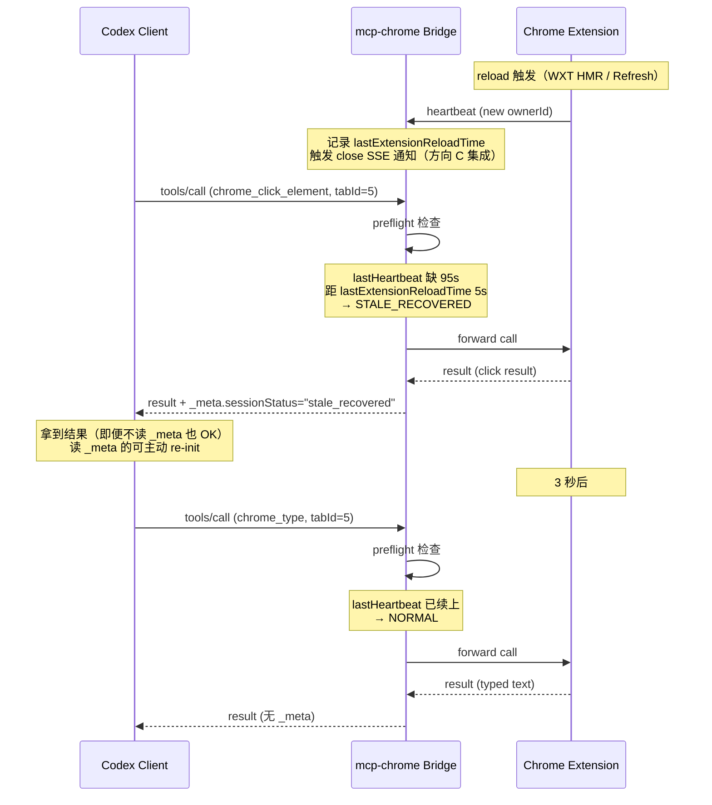
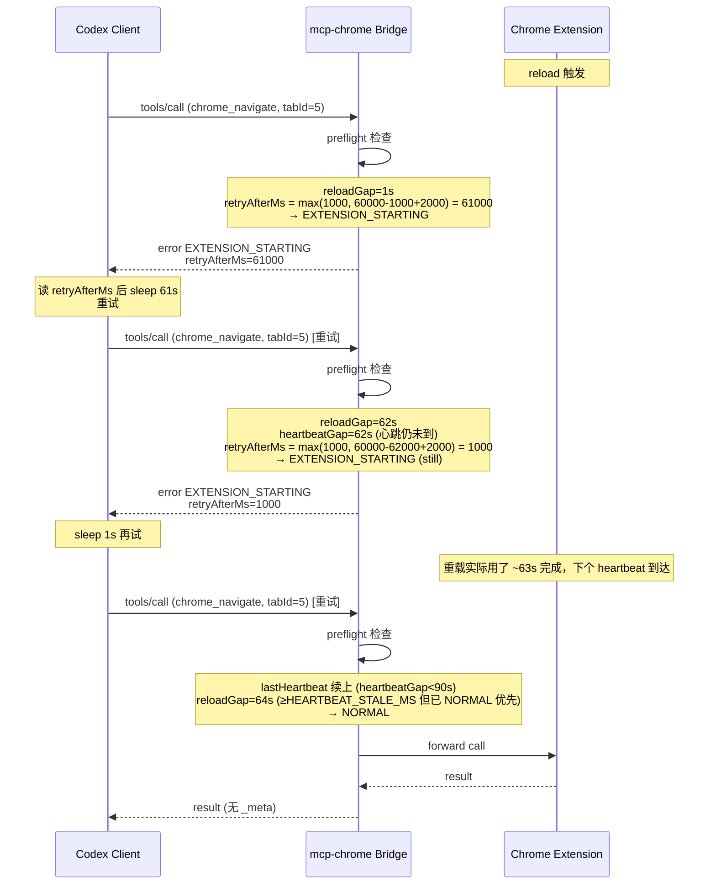

# RFC: MCP Session Soft Degradation Protocol (D 方案)

| Field          | Value                                  |
| -------------- | -------------------------------------- |
| Status         | Draft                                  |
| Author         | Codex                                  |
| Created        | 2026-08-02                             |
| Target version | v1.8.0                                 |
| Discussion     | handoff thread 2026-08-02 (D 方案讨论) |

## 1. 摘要

把 mcp-chrome bridge 在检测到 extension reload 时的"硬拒绝"（SESSION_EXPIRED）升级为"软降级"（soft degradation）。reload 期间或刚 reload 完成的请求**不被拒**，而是带 `_meta.sessionStatus` 标记降级处理；client 可以选择读 `_meta` 后 re-init，也可以忽略（仍拿到结果）。

**核心动机**：用户场景里"reload extension"是日常操作（HMR / `pnpm build` 高频触发），硬拒绝让所有 write 类工具 20s+ timeout，UX 极差。软降级让"reload 那一刻"的 write 工具仍可用。

## 2. 背景 / Motivation

### 2.1 当前行为（v1.7.4 之前）

bridge 检测到 session heartbeat gap > 90s（即 extension 重新加载过）→ 立即返回 SESSION_EXPIRED。所有 write 类工具（chrome_navigate / chrome_click_element / chrome_type / chrome_screenshot / chrome_javascript 等 14+ 个）必须等到 Codex 主动 re-init session 才能用。

实测问题：

- Codex 收到 SESSION_EXPIRED **不自动重连**（Codex desktop MCP transport 限制）
- 用户必须重启 Codex desktop 才能恢复
- 开发期 `pnpm build` 频繁触发 reload → 频繁卡 20s+ → 体验崩溃

### 2.2 类比（用户提的）

**银行 / 旧支票**：银行改了内部清分系统，不能拒收客户手里的旧支票；应接受旧支票、内部转换、告诉客户"下次用新格式"。

**跳频电台**：旧电台发固定频率信号，新电台不应直接拒收；应解码、回应"请跳到 X 频率同步"。

**协议姿态**：硬拒绝 → 软降级 + 主动告知（向后兼容 + 前向引导）。

### 2.3 已有方向对比

| 方向                     | 协议姿态    | 解决程度 | 工程成本 | Codex 收益                    |
| ------------------------ | ----------- | -------- | -------- | ----------------------------- |
| A: stdio 默认            | 绕开协议    | 100%     | 0        | 100%                          |
| B: sleep 5s 重试         | 等下次心跳  | ~80%     | 0        | 100%                          |
| C: bridge 主动 close SSE | 通知重连    | 0-10%    | 中       | 0% (Codex 不响应)             |
| **D: 软降级 + metadata** | 降级 + 告知 | ~95%     | 中-高    | **100% (不需要 client 升级)** |

D 的关键优势：**不依赖 Codex client 升级**。即便 Codex 完全不读 `_meta`，用户至少拿到结果，不会卡 20s。

## 3. 目标 / Goals

1. reload 期间或 reload 刚完成（< 30s）的 write 请求不被拒
2. response 带 `_meta` 标记降级状态，遵守 MCP spec 的 `_meta` 字段约定
3. 实现向后兼容：现有 client 不读 `_meta` 仍能工作
4. 不引入新的"必读"协议字段（避免变成 spec 强制要求）
5. 与现有 AGENTS.md §0b.7.8 文档体系兼容，扩展 §0b.7.8.7

## 4. 非目标 / Non-goals

1. 不解决 Codex client 不自动重连的 bug（D 解决"请求被拒"，不解决"client 不重连"）
2. 不替代方向 A（stdio 默认）。A 和 D 并存：A 是 dev 默认，D 是 HTTP variant 增强
3. 不替代方向 C（bridge 主动 close SSE）。C 在 reload 时仍可作为附加信号发，D 是主要协议姿态
4. 不解决 read 类工具问题（read 类 reload 后自动续，无需降级）
5. 不修改 MCP spec 本身（仅用 spec 允许的 `_meta` 字段扩展）

## 5. 方案 / Proposal

### 5.1 三态判定

bridge 在 preflight 阶段（旧 SESSION_EXPIRED 检查位置）改为四态判定（含一个原有 hard fail）。

判定逻辑（伪代码）：

```
heartbeatGap = now - conn.lastHeartbeat
reloadGap   = now - reloadContext.lastOwnerChangeMs

if (conn 不存在 或 conn.lastHeartbeat === 0) {
  return SESSION_NOT_FOUND (hard fail, 不可重试)
}

if (heartbeatGap < HEARTBEAT_STALE_MS) {
  return NORMAL (全部正常)
}

if (reloadGap < HEARTBEAT_STALE_MS) {
  return EXTENSION_STARTING (retryable)
}

return STALE_RECOVERED (降级处理)
```

判定条件表：

| 状态                 | 触发条件                                                                                                         | 行为              | response 标志                                                                 |
| -------------------- | ---------------------------------------------------------------------------------------------------------------- | ----------------- | ----------------------------------------------------------------------------- |
| `NORMAL`             | `heartbeatGap < HEARTBEAT_STALE_MS`（90s）                                                                       | 正常处理          | 无 `_meta`                                                                    |
| `STALE_RECOVERED`    | `heartbeatGap >= HEARTBEAT_STALE_MS` 且 `reloadGap >= HEARTBEAT_STALE_MS`（reload 已"足够久"，下一个心跳本应到） | 降级处理          | `_meta.sessionStatus = "stale_recovered"`, `recommendation = "re_initialize"` |
| `EXTENSION_STARTING` | `heartbeatGap >= HEARTBEAT_STALE_MS` 且 `reloadGap < HEARTBEAT_STALE_MS`（reload 后新心跳还没到）                | 拒绝（retryable） | `error.code = "EXTENSION_STARTING"`, `error.retryAfterMs = N`                 |
| `SESSION_NOT_FOUND`  | `conn` 不存在或从未收到任何 heartbeat                                                                            | 拒绝（不可重试）  | `error.code = "SESSION_NOT_FOUND"`                                            |

**阈值数学推导**（修订版，修正之前的 30s magic number）：

- 心跳周期 `HEARTBEAT_INTERVAL_MS = 60_000`（60s，见 `app/chrome-extension/entrypoints/background/bridge-control.ts`）
- stale 阈值 `HEARTBEAT_STALE_MS = 90_000`（90s = 1.5×心跳周期，宽容一次心跳丢失，见 `app/native-server/src/constant/index.ts`）
- reload 后的下一个心跳到达时间：`lastOwnerChangeMs + HEARTBEAT_INTERVAL_MS`（reload 立即发一次，再每 60s 一次）
- reload 后最大等待窗口：`HEARTBEAT_STALE_MS = 90s`（与 stale 阈值同源，对齐 §0b.7.8.5 健康检查）

**关键改进**：与之前的 30s 阈值相比，现在用 `HEARTBEAT_STALE_MS` 作锚，与现有 stale 阈值常量同源，不引入新 magic number。

**`SESSION_EXPIRED` 兼容性**：v1.8 之前的 `SESSION_EXPIRED` 用于"extension has not registered"和"reload 后 heartbeat gap 过大"两种情况。v1.8+ 拆成两个：

- `SESSION_NOT_FOUND`（新，替换"从未注册"情况）
- `EXTENSION_STARTING`（新，"reload 中"情况）

旧的 `SESSION_EXPIRED` 仍保留为 `SESSION_NOT_FOUND` 的 deprecated 别名，1 个 major 版本后移除。

### 5.2 metadata schema

**命名约定**：本节字段值使用 TypeScript-friendly snake_case（如 `stale_recovered`）。表格 / 流程图中的标签使用 SCREAMING_SNAKE_CASE（如 `STALE_RECOVERED`）。两者一一对应，代码里只信 snake_case。

response `_meta` 字段扩展（仅在降级 / 启动中状态附加）：

```typescript
interface McpSessionMeta {
  /** 必填：会话状态 */
  sessionStatus: 'normal' | 'stale_recovered' | 'extension_starting';

  /** stale_recovered 才有：距上次心跳的 gap（毫秒） */
  heartbeatGapMs?: number;

  /** stale_recovered 才有：liveTargets 距上次心跳同步的延迟（毫秒） */
  liveTargetsSyncLagMs?: number;

  /** stale_recovered 推荐动作 */
  recommendation?: 're_initialize';

  /** extension_starting 才有：建议 client sleep 后重试 */
  retryAfterMs?: number;

  /** 调试用：bridge 实例 ID */
  bridgeInstanceId?: string;

  /** 调试用：本次 extension 的 ownerId（reload 后会变） */
  extensionOwnerId?: string;
}
```

### 5.3 协议流（sequence diagram）



### 5.4 EXTENSION_STARTING 流（reload 中首次请求）



### 5.5 错误码定义

> **修订**：之前 RFC 提的 JSON-RPC `-32050` 是错的。本项目 bridge `errorResult` 用的是 **content payload 里的字符串 `code` 字段**（不是 JSON-RPC envelope 的 `error.code`）。原代码：

```typescript
// app/native-server/src/mcp/register-tools.ts
function errorResult(toolName: string, code: 'SESSION_EXPIRED' | 'TAB_GONE', message: string);
```

**v1.8+ 的字符串 code**（扩展原有 union type）：

```typescript
type ErrorCode =
  | 'SESSION_EXPIRED' // deprecated alias for SESSION_NOT_FOUND
  | 'SESSION_NOT_FOUND' // new: extension has not registered
  | 'EXTENSION_STARTING' // new: extension is reloading
  | 'TAB_GONE' // unchanged
  | 'INTERNAL_ERROR'; // unchanged
```

**response payload 示例**：

```json
{
  "isError": true,
  "content": [
    {
      "type": "text",
      "text": "{\"code\":\"EXTENSION_STARTING\",\"retryAfterMs\":32000,\"elapsedSinceReloadMs\":1234,\"message\":\"extension reloading, retry after 32s\"}"
    }
  ]
}
```

> **为什么用字符串 code 而不是 JSON-RPC -32050**：与现有 bridge 代码风格一致；避免在 `error.code`（数字）和 `content[].text.code`（字符串）之间制造混淆；老 client 看到的是同一个 `content[].text` JSON，解析逻辑不变。

## 6. 具体改动

### 6.1 bridge 代码

#### 6.1.1 新增 metadata 注入工具

```typescript
// app/native-server/src/mcp/session-meta.ts (新文件)
export interface McpSessionMeta {
  sessionStatus: 'normal' | 'stale_recovered' | 'extension_starting';
  heartbeatGapMs?: number;
  liveTargetsSyncLagMs?: number;
  recommendation?: 're_initialize';
  retryAfterMs?: number;
  bridgeInstanceId?: string;
  extensionOwnerId?: string;
}

export function buildSessionMeta(
  conn: ExtensionConnection,
  reloadContext: ReloadContext,
): McpSessionMeta {
  const now = Date.now();
  const heartbeatGapMs = now - conn.lastHeartbeat;
  const reloadGapMs = now - reloadContext.lastOwnerChangeMs;

  // heartbeat 还在 stale 阈值内 — 与 reload 状态无关
  if (heartbeatGapMs < HEARTBEAT_STALE_MS) {
    return { sessionStatus: 'normal' };
  }

  // heartbeat gap >= HEARTBEAT_STALE_MS
  // reload 已发生且在窗口内 — 等下一个心跳
  if (reloadContext.lastOwnerChangeMs > 0 && reloadGapMs < HEARTBEAT_STALE_MS) {
    // retryAfterMs = "等下一个心跳 + 2s 安全 margin"
    // 公式：HEARTBEAT_INTERVAL_MS - reloadGapMs + 2000
    // 上限 fallback：reloadGapMs 接近 90s 时仍返回 1s（马上 STALE_RECOVERED）
    const retryAfterMs = Math.max(1000, HEARTBEAT_INTERVAL_MS - reloadGapMs + 2_000);
    return {
      sessionStatus: 'extension_starting',
      retryAfterMs,
      heartbeatGapMs,
      reloadGapMs,
    };
  }

  // heartbeat gap >= HEARTBEAT_STALE_MS 且 reload 早已发生
  // （或者从没检测到 reload 但 heartbeat 还是缺 — 走 §6.1.2 的 SESSION_NOT_FOUND）
  return {
    sessionStatus: 'stale_recovered',
    heartbeatGapMs,
    liveTargetsSyncLagMs: computeLiveTargetsSyncLag(conn, reloadContext, now),
    recommendation: 're_initialize',
  };
}

/**
 * liveTargets 距 reload 的同步延迟。
 *
 * 准确版定义：reload 发生到 liveTargets 反映新 extension 状态的时间差。
 * 由于 liveTargets 在每次 heartbeat 时同步，而 heartbeat 是 60s 周期，
 * 这个延迟实际上 = `lastHeartbeatMs - lastOwnerChangeMs`（reload 后到下一个 heartbeat）。
 *
 * 边界：
 * - 从未 reload：0
 * - reload 后心跳还没到：`reloadContext.lastOwnerChangeMs` 自身（`max(heartbeat, reloadMs) = reloadMs`，lag=0）
 * - reload 后心跳到了：`lastHeartbeatMs - lastOwnerChangeMs`（准确值，0~60s）
 *
 * 不接收 `now` 参数：公式仅依赖 conn.lastHeartbeat 和 reloadContext.lastOwnerChangeMs。
 */
function computeLiveTargetsSyncLag(
  conn: ExtensionConnection,
  reloadContext: ReloadContext,
): number {
  if (reloadContext.lastOwnerChangeMs === 0) return 0;
  const newHeartbeatMs = Math.max(conn.lastHeartbeat, reloadContext.lastOwnerChangeMs);
  return Math.max(0, newHeartbeatMs - reloadContext.lastOwnerChangeMs);
}
```

#### 6.1.2 改 preflight 为三态

```typescript
// app/native-server/src/mcp/register-tools.ts (改 runPreflight)
import { buildSessionMeta, ReloadContext } from './session-meta';

export function runPreflight(
  name: string,
  args: any,
  reloadContext: ReloadContext,
): PreflightResult | null {
  // ... 现有 Safe 逻辑不变

  // TabBound + CdpBound
  if (!conn || conn.lastHeartbeat === 0) {
    // v1.8+ SESSION_NOT_FOUND：从未收到任何 heartbeat
    // v1.7.4 之前用 SESSION_EXPIRED；v1.8 拆出，保留旧 code 作为 deprecated alias
    return errorResult(
      name,
      'SESSION_NOT_FOUND',
      'extension has not registered since bridge start',
    );
  }

  if (Date.now() - conn.lastHeartbeat > HEARTBEAT_STALE_MS) {
    // heartbeat stale — 走 buildSessionMeta 四态判定
    const meta = buildSessionMeta(conn, reloadContext);

    if (meta.sessionStatus === 'extension_starting') {
      return {
        isError: true,
        content: [
          {
            type: 'text',
            text: JSON.stringify({
              code: 'EXTENSION_STARTING',
              retryAfterMs: meta.retryAfterMs,
              heartbeatGapMs: meta.heartbeatGapMs,
              reloadGapMs: meta.reloadGapMs,
            }),
          },
        ],
      };
    }

    if (meta.sessionStatus === 'stale_recovered') {
      // 不拒绝 — 由调用方在 result 上附加 _meta
      return { degraded: true, meta };
    }

    // 这里理论上走不到（buildSessionMeta 总返回 NORMAL/STALE_RECOVERED/EXTENSION_STARTING）
    // 保留 fallback 以防未来加状态漏改
    return errorResult(
      name,
      'SESSION_NOT_FOUND',
      `last heartbeat ${Math.round((Date.now() - conn.lastHeartbeat) / 1000)}s ago, no reload detected`,
    );
  }

  // ... 后续 liveTargets 检查同样返回 degraded 而非 error
}
```

#### 6.1.3 改 handleToolCall 附加 _meta

```typescript
// app/native-server/src/mcp/register-tools.ts (改 handleToolCall)
export async function handleToolCall(...): Promise<CallToolResult> {
  const preflight = runPreflight(name, args, reloadContext);
  if (preflight?.isError) return preflight;

  // 新增：degraded 标记
  const degradedMeta = preflight?.degraded ? preflight.meta : null;

  let result: CallToolResult;
  try {
    result = await runTool(name, args);
  } catch (e) {
    result = errorResult(name, 'INTERNAL_ERROR', e.message);
  }

  // 附加 _meta
  if (degradedMeta) {
    result._meta = { ...result._meta, ...degradedMeta };
  }

  return result;
}
```

#### 6.1.4 跟踪 ownerId 变化（触发 reloadContext）

> **实现说明**：RFC 草稿用 `class ReloadContextTracker`。Phase 1b 落地时改为
> module-level 函数（`observeHeartbeat` / `getReloadContext` / `_resetReloadContextForTests`），
> 与 `control-state.ts`（同模块已存在的 state 跟踪器）保持一致。状态仍是
> module-singleton；测试通过 `_resetReloadContextForTests` 清理。

```typescript
// app/native-server/src/mcp/reload-context.ts
let lastOwnerId: string | null = null;
let lastOwnerChangeMs = 0;

export function observeHeartbeat(ownerId: string, nowMs: number = Date.now()): void {
  if (lastOwnerId === null) {
    // First observation — initialize. NOT a reload.
    lastOwnerId = ownerId;
    return;
  }
  if (ownerId === lastOwnerId) {
    return; // Same owner — normal heartbeat.
  }
  // Owner changed — reload detected.
  lastOwnerId = ownerId;
  lastOwnerChangeMs = nowMs;
}

export function getReloadContext(): ReloadContext {
  return { lastOwnerId, lastOwnerChangeMs };
}

export function _resetReloadContextForTests(): void {
  lastOwnerId = null;
  lastOwnerChangeMs = 0;
}
```

**与 RFC §5.1 / §5.2 语义对齐**：

- 第一次 `observeHeartbeat`（`lastOwnerId === null`）→ 设 `lastOwnerId = ownerId`，但
  `lastOwnerChangeMs` 保持 0。`buildSessionMeta` 把这解读为 "no reload detected"
  → STALE_RECOVERED 路径（如果 heartbeat stale）或 NORMAL（如果 heartbeat 新鲜）。
- 后续同 owner → no-op（普通 heartbeat 60s 一次）。
- 后续不同 owner → reload detected，`lastOwnerChangeMs` 更新。

**集成点（Phase 3）**：`app/native-server/src/server/index.ts` 的
`POST /internal/heartbeat` 处理器在调用 `recordExtensionConnection` 之后调
`observeHeartbeat(body.ownerId)`（需要先扩展 heartbeat body 接受 `ownerId` 字段）。

**集成点（Phase 2）**：`runPreflight` 调 `getReloadContext()` + `buildSessionMeta(conn, ctx)`
实现四态判定。

````

### 6.2 AGENTS.md 改动

#### 6.2.1 §0b.7.8 加 #7 段

在 §0b.7.8 末尾追加：

```markdown
**7. 软降级协议 (v1.8+，详见 `docs/rfcs/2026-08-02-mcp-session-soft-degradation.md`):**

- 设计动机：见上文"银行/跳频电台"类比 — server 内部状态变化时，不硬拒绝 client 旧 contract 请求。
- 三态判定（替代之前的二态"接受/拒绝"）：

| 状态                 | 触发条件                                                                  | 行为              | response 标志                                                             |
| -------------------- | ------------------------------------------------------------------------- | ----------------- | ------------------------------------------------------------------------- |
| `NORMAL`             | `heartbeatGap < HEARTBEAT_STALE_MS`                                       | 正常处理          | 无 `_meta`                                                                |
| `STALE_RECOVERED`    | `heartbeatGap >= HEARTBEAT_STALE_MS` 且 `reloadGap >= HEARTBEAT_STALE_MS` | 降级处理          | `_meta.sessionStatus="stale_recovered"`, `recommendation="re_initialize"` |
| `EXTENSION_STARTING` | `heartbeatGap >= HEARTBEAT_STALE_MS` 且 `reloadGap < HEARTBEAT_STALE_MS`  | 拒绝（retryable） | `error.code="EXTENSION_STARTING"`, `error.retryAfterMs=N`                 |
| `SESSION_NOT_FOUND`  | `conn` 不存在或从未收到 heartbeat                                         | 拒绝（不可重试）  | `error.code="SESSION_NOT_FOUND"`                                          |

- 核心差异（vs 之前 SESSION_EXPIRED）：
  - 之前：reload 后 write 类工具必返 SESSION_EXPIRED，user 必须重启 Codex
  - 现在：reload 后 write 类工具**第一次**可能返 STALE_RECOVERED（拿到结果）或 EXTENSION_STARTING（sleep 后重试），第二次正常
- 不依赖 Codex client 升级：D 在 Codex 不读 `_meta` 的情况下也能改善 UX（拿到结果，比硬拒绝好）
- 配合 §0b.7.8.3 stdio fallback 用：在 stdio variant 下，session 概念不存在，自动 init，无需软降级
- 集成方向 C 的考量：D 不集成方向 C（bridge 主动 close SSE）。C 是独立 future-work，依赖 Codex 升级。详见 §10 开放问题 #3

**与 v1.7.4 行为对比表**：

| 场景                                    | v1.7.4 行为             | v1.8+ 行为                                                                      |
| --------------------------------------- | ----------------------- | ------------------------------------------------------------------------------- |
| Extension 启动稳定 → 调 write           | NORMAL                  | NORMAL                                                                          |
| Reload 后立即调 write（heartbeat 还缺） | SESSION_EXPIRED（硬拒） | `EXTENSION_STARTING`（retryable）+ `retryAfterMs`                               |
| Reload 后心跳已续（reload 已 ≥90s）     | SESSION_EXPIRED（硬拒） | `STALE_RECOVERED`（降级处理 + `_meta`）                                         |
| Extension 从未注册                      | SESSION_EXPIRED         | `SESSION_NOT_FOUND`                                                             |
| Codex 拿到硬错误                        | 必须重启 Codex          | `EXTENSION_STARTING` 等 sleep 后重试；`SESSION_NOT_FOUND` 必须 reload extension |

> 注意 `SESSION_EXPIRED` 在 v1.8 仍保留为 `SESSION_NOT_FOUND` 的 deprecated alias，下一个 major 版本移除。
````

#### 6.2.2 §0b.7.8.1 改 SESSION_EXPIRED 处置

```markdown
- **Agent 处置 (按 §0b.4 防 debug-spree):**
  - 收到 `error.code="EXTENSION_STARTING"`: 读 `error.retryAfterMs`，sleep 后重试（v1.8+ 推荐行为）
  - 收到 `_meta.sessionStatus="stale_recovered"`: 请求成功但降级，可选 re-init
  - 收到 `error.code="SESSION_NOT_FOUND"`（或 deprecated `SESSION_EXPIRED`）: 不可重试，必须 reload extension
  - **严禁** kill Chrome / 换 user-data-dir / 手搓 WebSocket CDP client 绕过 MCP（按 §0b.4）
```

### 6.3 文档/CHANGELOG

- `docs/CHANGELOG.md` 加 v1.8.0 条目
- `docs/rfcs/2026-08-02-mcp-session-soft-degradation.md`（本文）
- `~/.codex/AGENTS.md` 由用户手动同步 §0b.7.8.7 段落（不强制）

## 7. 测试计划

### 7.1 单元测试（bridge）

```typescript
// app/native-server/src/mcp/session-meta.test.ts (新)
describe('buildSessionMeta', () => {
  it('returns normal when heartbeat is fresh', () => {...});
  it('returns extension_starting when reload within 30s', () => {...});
  it('returns stale_recovered when reload > 30s but heartbeat gap > 90s', () => {...});
  it('handles rapid successive reloads (HMR)', () => {...});
  it('caps retryAfterMs to 30s max', () => {...});
});

// app/native-server/src/mcp/register-tools.test.ts (改)
describe('runPreflight three-state judgment', () => {
  it('returns degraded meta for stale_recovered', () => {...});
  it('returns error for extension_starting with retryAfterMs', () => {...});
  it('returns normal for fresh heartbeat', () => {...});
  it('preserves backward compat for old SESSION_EXPIRED', () => {...});
});
```

### 7.2 集成测试

**场景 1：reload 后 chrome_click_element 拿结果**

```
1. bridge + extension 启动稳定
2. chrome_get_windows_and_tabs 验证 read 类 OK
3. chrome_click_element 验证 write 类 OK
4. 触发 extension reload（`pnpm build` 或 Alt+R）
5. 立即 chrome_click_element
6. 期望：要么 STALE_RECOVERED + click 结果，要么 EXTENSION_STARTING + retryAfterMs
7. 不期望：SESSION_EXPIRED 硬拒
```

**场景 2：reload 中 chrome_navigate**

```
1. 触发 reload (假设 reloadGap=0)
2. 立即 chrome_navigate
3. 期望：EXTENSION_STARTING + retryAfterMs=max(1000, HEARTBEAT_INTERVAL_MS - 0 + 2000)=62000
4. sleep 62s 后重试（实测 reload 实际完成时间）
5. 期望：NORMAL + navigate 结果

注：场景 2 的 retryAfterMs 是动态的。reloadGap 越大 retryAfterMs 越小，到 reloadGap>=HEARTBEAT_STALE_MS 自动转 STALE_RECOVERED。
```

**场景 3：HMR 多次 reload**

```
1. 5 秒内触发 3 次 reload（模拟 HMR）
2. 期间 chrome_type 多次调用
3. 期望：每次 reload 后第一次调用要么 STALE_RECOVERED 要么 EXTENSION_STARTING，最终一致
4. 不期望：crash / OOM / 状态错乱
```

**场景 4：reload 后第一次 chrome_screenshot.savePath**

```
1. reload
2. chrome_screenshot({savePath: "..."})
3. 期望：v1.7.4 savePath fix + v1.8 软降级协同工作
   - 不出现 20s timeout（v1.7.4 修复）
   - 不出现 SESSION_EXPIRED（v1.8 软降级）
   - 文件成功落盘
```

### 7.3 兼容性测试

- 用旧 client（Codex 当前版本）调用新 bridge：应该拿到 STALE_RECOVERED 结果（client 忽略 _meta）
- 用新 client（假设未来 Codex 升级读 _meta）调用新 bridge：应该看到降级提示并主动 re-init
- 用新 client 调用旧 bridge（v1.7.4）：行为同 v1.7.4（无 _meta，无降级）

## 8. 风险

### 8.1 STALE_RECOVERED 结果可能陈旧

如果 reload 后第一次调用 `chrome_get_windows_and_tabs`，liveTargets 还没同步，返回的 tab 列表可能漏掉新开的 tab。

**缓解**：`_meta.liveTargetsSyncLagMs` 显式标记延迟，让 client 知道是降级结果。

### 8.2 EXTENSION_STARTING 重试时间估算不准

reload 可能要 5s+（特别是有 offscreen document）。`HEARTBEAT_INTERVAL_MS = 60s` 周期下，"reload 后下一个新心跳何时到"是 0~60s 的不确定区间。

**缓解**：retryAfterMs 动态计算 = `max(1000, HEARTBEAT_INTERVAL_MS - reloadGapMs + 2000)`。这是"等到下一个 heartbeat + 2s 安全 margin"的下界估计。客户端 sleep 这个时间后重试，最坏情况多等 ~2s 进 NORMAL 分支。

边界保护：如果 reloadGapMs >= HEARTBEAT_STALE_MS（reload 已"足够久"），状态从 EXTENSION_STARTING 自动转 STALE_RECOVERED，client 不再 retry 而是接受降级结果。

### 8.3 ownerId 不稳定

理论上 ownerId 在 reload 时变化，但如果有其他机制导致 ownerId 短暂消失又出现，会误判 reload。

**缓解**：ownerId 变化需要"old → null → new" 完整序列才算 reload。仅 ownerId 字段为空不算 reload。

### 8.4 协议姿态变化影响其他 client

如果未来有别的 MCP client 接入 mcp-chrome，它们可能依赖"硬拒绝 = 重连"的行为。

**缓解**：在 `docs/` 写清楚协议姿态，软降级是默认行为。

- 依赖硬拒绝的 client（v1.7.4 及之前的 Codex）→ 升级到 v1.8+ 后应主动读 `_meta.sessionStatus` 处理 STALE_RECOVERED（按需 re-init）；不读也能 work（拿到降级结果但仍可用）
- 新 client 实现者 → 优先实现 `EXTENSION_STARTING` 重试逻辑（按 `retryAfterMs` sleep），次选实现 `_meta.sessionStatus` re-init

注：本 RFC (D) 不依赖 Codex 升级。即便 Codex 完全不读 `_meta`、不响应 SSE close，D 仍能改善 UX（拿到结果，比硬拒好）。方向 C 是独立 future-work。

## 9. 替代方案 / Alternatives

### 9.1 维持硬拒绝 + 文档化 fallback（不做 D）

维持当前行为，AGENTS.md 写清楚 reload 后必须 reload Codex。

**缺点**：UX 差，与类比设计哲学不符。

### 9.2 完全静默忽略 stale session（更激进）

任何 heartbeat 缺 > 90s 都接受，不附加 _meta。

**缺点**：失去 client 主动 re-init 的机会，长期累积 stale 状态。

### 9.3 引入新工具 `re_initialize_session` 替代 _meta

让 client 主动调用 re_initialize 而不是读 _meta。

**缺点**：增加 API surface，破坏"最小可用 client"原则。

## 10. 开放问题 / Open Questions

1. ~~**`-32050` 错误码是否合适？**~~ **已解决**：改用本项目字符串 `code` 字段（与现有 `SESSION_EXPIRED | TAB_GONE` union type 一致）。不用 JSON-RPC envelope 的数字 code，避免与现有错误返回路径分裂。详见 §5.5。
2. ~~**STALE_RECOVERED 的 30s 阈值怎么调？**~~ **已解决**：用 `HEARTBEAT_STALE_MS = 90_000` 作锚，与现有 stale 阈值常量同源，避免 magic number。详见 §5.1 阈值数学推导。
3. **是否同时引入 `notifications/session_stale` SSE 事件？** 方向 C 的扩展，独立 track。依赖 Codex 升级响应 SSE close，本 RFC (D) 不集成。
4. **v1.7.4 savePath fix 是否需要 retry？** 当前 fix 是单次，reload 后第一次调用可能进入 STALE_RECOVERED 路径。需要集成测试场景 4（§7.2）验证协同工作。
5. **simulateReloadForTest 的暴露方式？** 测试场景 4 / 7.2 / 7.3 都需要确定性触发 reload（不依赖真实 Chrome 事件）。方案：bridge 模块导出 `__test_simulateReload(ownerId)`，jest 测试里调；生产构建 tree-shake 掉。

## 11. 实施计划

| 阶段     | 内容                                                                                            | 估计时间      |
| -------- | ----------------------------------------------------------------------------------------------- | ------------- |
| 1a       | bridge 端 `ReloadContext` 类型 + `buildSessionMeta` 函数 + 单测（mock ReloadContext）           | 半天          |
| 1b       | bridge 端 `ReloadContextTracker` 类 + 单测（观察 ownerId 变化 + 计算 reloadGap）                | 半天          |
| 2        | bridge 端 register-tools.ts 改 preflight + handleToolCall                                       | 半天          |
| 3        | bridge 端 bridge-control.ts 集成 ReloadContextTracker（heartbeat handler 处调用）               | 半天          |
| 4        | 集成测试 7.2 全部场景通过（用 1b 的 simulateReloadForTest 触发 reload，不依赖真实 Chrome 事件） | 1 天          |
| 5        | AGENTS.md §0b.7.8.7 段写入 + 全局副本同步                                                       | 1 小时        |
| 6        | CHANGELOG + release notes                                                                       | 1 小时        |
| 7        | （已取消）集成 direction C 不在本 RFC 范围内                                                    | —             |
| **合计** |                                                                                                 | **约 3.5 天** |

## 12. 参考

- MCP spec 2025-06-18: https://modelcontextprotocol.io/specification/2025-06-18/
- MCP spec § "Error Handling" — vendor-defined error codes
- AGENTS.md §0b.7.8（当前 SESSION_EXPIRED 契约）
- handoff thread 2026-08-02（D 方案讨论起源）
- 用户类比：银行接受旧支票 / 跳频电台频率协商
